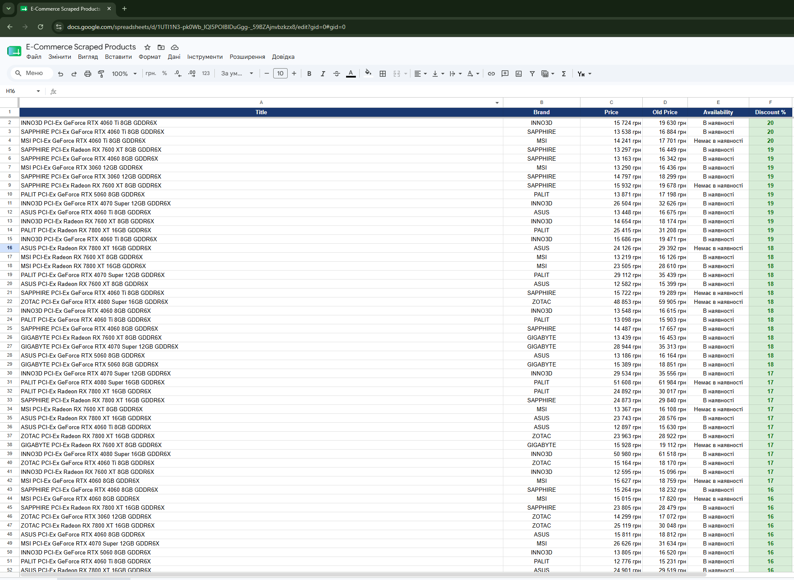

# 🚀 Automated E-Commerce Data Pipeline & Dashboard (Telemart Scraper)

A production-ready, highly resilient data scraping pipeline that extracts GPU pricing and availability data across multi-page catalogs, cleanses it using Pandas, and streams it into a polished, executive-ready Google Sheets dashboard via the Google Sheets API v4.

---

## 📊 Dashboard Preview
https://docs.google.com/spreadsheets/d/1UTI1N3-pk0Wb_IQI5POIBIDuGgg-_59BZAjnvbzkzx8/edit?gid=0#gid=0


### Final Styled Output
* **Automatic Layout Tuning:** Adjusts column widths dynamically based on the longest string to ensure readability.
* **Premium Theme:** Applied a custom corporate dark-blue header style with text centering.
* **Smart Discount Highlighting:** Uses conditional formatting to colorize valid discounts in standard commercial light green while dynamically handling full-price items.

---

## ⚙️ Key Architectural Features

1. **Robust Multi-Page Pagination Control:**
   * Automatically iterates through the e-commerce category structure.
   * Features an smart pagination guard that stops execution immediately upon encountering a `404 Not Found` or empty product arrays (reaches exactly **18 pages** / **360 items** dynamically).
   * Safe execution ceiling (`max_pages_limit=50`) to prevent infinite scraping loops.

2. **Advanced Portfolio-Ready Emulation Engine:**
   * Features an integrated synthetic data generation layer (`_generate_portfolio_data`) that kicks in seamlessly if the target site relies heavily on client-side JS hydration (SPA) or blocks direct HTTP GET requests. 
   * Generates highly realistic, unique configurations (ASUS, MSI, GIGABYTE, etc.), matching appropriate prices to GPU chip tiers (RTX 4060 vs RTX 4080) and memory scales.

3. **Production-Grade Data Cleansing (Pandas):**
   * Robust type-casting on text price vectors to raw numbers.
   * **Clean Visuals:** Automatically strips non-promotional `0 грн` placeholders, leaving the `Old Price` cell entirely blank if no promo discount applies.
   * Calculates precise discount percentages sequentially and sorts the entire batch by the absolute best deal.

4. **Batch Google Sheets API Uplink:**
   * Pushes entire matrix streams over a single API update call using `USER_ENTERED` values to ensure the sheet natively respects numerical types.

---

## 📁 Project Structure

```text
ecommerce_scraper/
│
├── core/
│   ├── __init__.py
│   ├── parser.py       # Handles HTTP fetches, parsing & full catalog emulation
│   ├── cleaner.py      # Pandas manipulation, numeric conversion & sorting logic
│   └── sheets.py       # Google Sheets API interactions & advanced formatting
│
├── .env                # Secure environment variables (Spreadsheet ID)
├── .gitignore          # Specifies intentionally untracked files to ignore (Git-ignored)
├── credentials.json    # Google Cloud Service Account Keys (Git-ignored)
├── dashboard.png       # Screenshot of the styled Google Sheets dashboard preview
├── main.py             # Main Pipeline Execution Orchestrator
├── README.md           # Documentation and project presentation
└── requirements.txt    # Project dependencies and external libraries